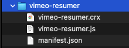
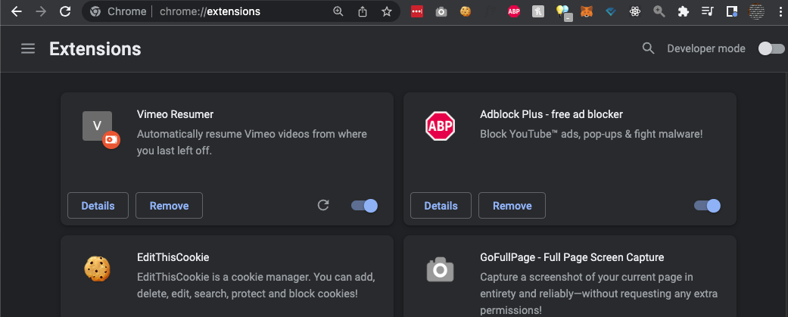
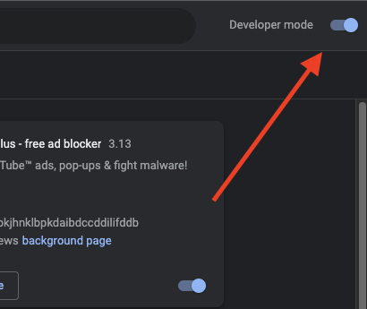
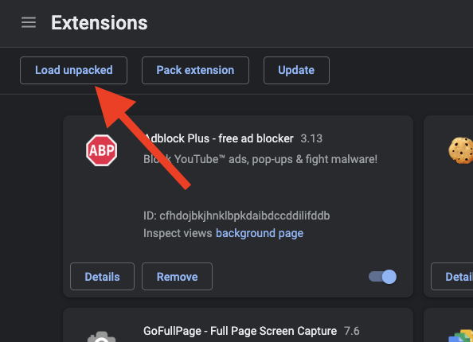
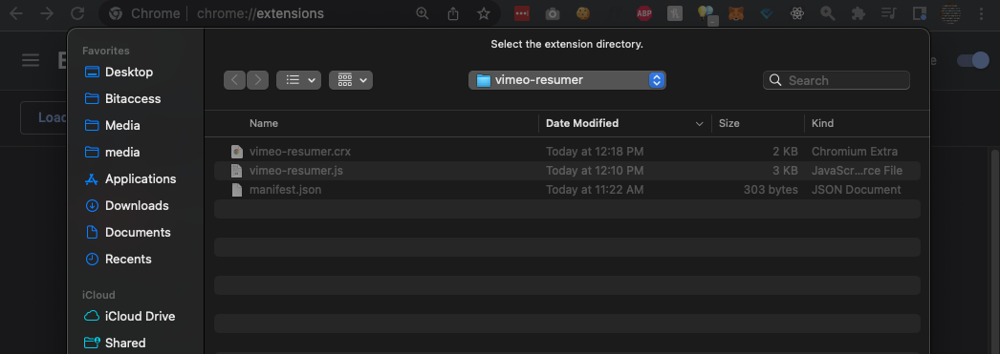

# Vimeo Resumer Chrome Extension

A chrome extension that automatically resumes Vimeo videos from where you last left off.

## Installation Guide

1. Clone or download the zip for this respository.

1. Unzip / unpack the downloaded .zip file if you didn't clone the repository in step #1.

    

    **Before**

    

    **After**

1. In your chrome browser, type this into your URL and press enter `chrome://extensions/`

    

1. In the top *right* corner, enable “Developer mode”.

    

1. In the top *left* corner, click the “Load unpacked” button.

    

1. Select the repository or unzipped / unpacked folder from step #2.

    

**Done.**
